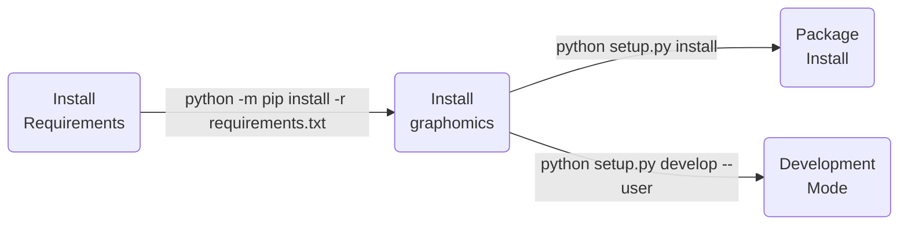

| **Authors**  | **Project** |  **Documentation** | **Build Status** | **Code Quality** |
|:------------:|:-----------:|:------------------:|:----------------:|:----------------:|
| [**N. Curti**](https://github.com/Nico-Curti) <br/> [**G. Carlini**](https://github.com/GianlucaCarlini) <br/> [**R.Biondi**](https://github.com/RiccardoBiondi) | **graphomics** | [](https://github.com/Nico-Curti/graphomics/actions/workflows/docs.yml) <br/> [](https://graphomics.readthedocs.io/en/latest/?badge=latest) | [](https://github.com/Nico-Curti/graphomics/actions/workflows/python.yml) | **TODO** |

**Appveyor:** [](https://ci.appveyor.com/project/Nico-Curti/graphomics-9jr6a/branch/main)

[](https://github.com/Nico-Curti/graphomics/pulls)
[](https://github.com/Nico-Curti/graphomics/issues)

[](https://github.com/Nico-Curti/graphomics/stargazers)
[](https://github.com/Nico-Curti/graphomics/watchers)

<a href="https://github.com/UniboDIFABiophysics">
  <div class="image">
    
  </div>
</a>

# pygraphomics v0.0.1

## Graphomics feature extraction in Python

This is an open-source python package for the extraction of Graphomics features from medical imaging.

With this package we aim to propose a new reference for Medical Image Analysis given by the Graphomics approach, i.e. the analysis of the topological graph described by any 2D or 3D object.
By doing so, we hope to increase awareness of graphomics capabilities and expand the community.

The platform supports both the feature extraction in 2D and 3D and can be used to calculate features according to different label maps and network weighting.

**Not intended for clinical use.**

* [Overview](#overview)
* [Prerequisites](#prerequisites)
* [Installation](#installation)
* [Usage](#usage)
* [Testing](#testing)
* [Table of contents](#table-of-contents)
* [Contribution](#contribution)
* [References](#references)
* [FAQ](#faq)
* [Authors](#authors)
* [License](#license)
* [Acknowledgments](#acknowledgments)
* [Citation](#citation)

## Overview

**TODO**

### Graphomics Features

**TODO**

## Prerequisites

The complete list of requirements for the graphomics package is reported in the [requirements.txt](https://github.com/Nico-Curti/graphomics/blob/main/requirements.txt)

## Installation

Python version supported : 

The easiest way to the get the `graphomics` package in `Python` is via pip installation

```bash
python -m pip install graphomics
```

or via `conda`:

```bash
conda install graphomics
```

The `Python` installation for *developers* is executed using [`setup.py`](https://github.com/Nico-Curti/graphomics/blob/main/setup.py) script.



## Usage

You can use the `graphomics` library into your Python scripts or directly via command line.

### Command Line Interface

**TODO**

### Python script

**TODO**

## Testing

**TODO**

## Table of contents

Description of the folders related to the `Python` version.

| **Directory** |  **Description** |
|:-------------:|:-----------------|
| *TODO*        | *TODO*           |

## Contribution

Any contribution is more than welcome :heart:. Just fill an [issue](https://github.com/Nico-Curti/graphomics/blob/main/.github/ISSUE_TEMPLATE/ISSUE_TEMPLATE.md) or a [pull request](https://github.com/Nico-Curti/graphomics/blob/main/.github/PULL_REQUEST_TEMPLATE/PULL_REQUEST_TEMPLATE.md) and we will check ASAP!

See [here](https://github.com/Nico-Curti/graphomics/blob/main/.github/CONTRIBUTING.md) for further informations about how to contribute with this project.

## References

<blockquote>1- paper </blockquote>

## FAQ

**TODO**

## Authors

*  **Nico Curti** [git](https://github.com/Nico-Curti), [unibo](https://www.unibo.it/sitoweb/nico.curti2)

*  **Gianluca Carlini** [git](https://github.com/GianlucaCarlini), [unibo](https://www.unibo.it/sitoweb/gianluca.carlini3)

*  **Riccardo Biondi** [git](https://github.com/RiccardoBiondi), [unibo](https://www.unibo.it/sitoweb/riccardo.biondi7)

See also the list of [contributors](https://github.com/Nico-Curti/graphomics/contributors) [](https://github.com/Nico-Curti/graphomics/graphs/contributors/) who participated in this project.

## License

The `graphomics` package is licensed under the BSD 3-Clause "New" or "Revised" [License](https://github.com/Nico-Curti/graphomics/blob/main/LICENSE).

## Acknowledgments

Thanks goes to all contributors of this project.

## Citation

If you have found `graphomics` helpful in your research, please consider citing the original repository

```BibTeX
@misc{pygraphomics,
  author = {Curti, Nico and Carlini, Gianluca and Biondi, Riccardo},
  title = {graphomics - Graphomics feature extraction in Python},
  year = {2023},
  publisher = {GitHub},
  howpublished = {\url{https://github.com/Nico-Curti/graphomics}}
}
```

