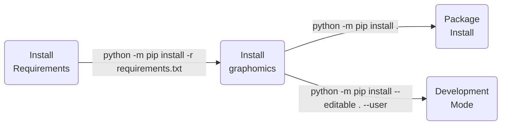

<p align="center">
  
  <br>
  <b>
    pyGraphomics
  </b>
</p>

| **Authors**  | **Project** |  **Documentation** | **Build Status** | **Code Quality** | **Coverage** |
|:------------:|:-----------:|:------------------:|:----------------:|:----------------:|:------------:|
| [**N. Curti**](https://github.com/Nico-Curti) <br/> [**G. Carlini**](https://github.com/GianlucaCarlini) <br/> [**R.Biondi**](https://github.com/RiccardoBiondi) | **graphomics** | [](https://github.com/Nico-Curti/graphomics/actions/workflows/docs.yml) <br/> [](https://graphomics.readthedocs.io/en/latest/?badge=latest) | [](https://github.com/Nico-Curti/graphomics/actions/workflows/python.yml) | **TODO** | [](https://codecov.io/gh/Nico-Curti/graphomics) |

**Appveyor:** [](https://ci.appveyor.com/project/Nico-Curti/graphomics-9jr6a/branch/main)

[](https://github.com/Nico-Curti/graphomics/pulls)
[](https://github.com/Nico-Curti/graphomics/issues)

[](https://github.com/Nico-Curti/graphomics/stargazers)
[](https://github.com/Nico-Curti/graphomics/watchers)

<a href="https://github.com/UniboDIFABiophysics">
  <div class="image">
    
  </div>
</a>

# graphomics v0.0.1

## Graphomics feature extraction in Python

This is an open-source python package for the extraction of Graphomics features from medical imaging.

With this package we aim to propose a new reference for Medical Image Analysis given by the Graphomics approach, i.e. the analysis of the topological graph described by any 2D or 3D object.
By doing so, we hope to increase awareness of graphomics capabilities and expand the community.

The platform supports both the feature extraction in 2D and 3D and can be used to calculate features according to different label maps and network weighing.

**Not intended for clinical use.**

* [Overview](#overview)
* [Prerequisites](#prerequisites)
* [Installation](#installation)
* [Usage](#usage)
* [Testing](#testing)
* [Table of contents](#table-of-contents)
* [Contribution](#contribution)
* [References](#references)
* [FAQ](#faq)
* [Authors](#authors)
* [License](#license)
* [Acknowledgments](#acknowledgments)
* [Citation](#citation)

## Overview

The aim of the graphomic analysis is to leverage topology to extract a series of informative features.
To this purpose, the `graphomics` package represents a novel approach to medical image analysis, providing algorithms tailored to extract network-based information from 2D/3D medical images.
Starting from the quantification of the skeleton of a 3D Volume of Interest (VOI), the 3D underlying network is evaluated, providing a novel set of information and features which could integrate the standard Radiomics analysis.
The proposed method is totally independent of the medical image task and relies only on the availability of a segmented VOI, i.e., the analogous constraint of any Radiomics application.
An example of the so-called *skeleton graph* obtained by the processing of a brain volume structure is showed in the following image.

<p align="center">
  
</p>

A wide list of network-based features could be extracted analyzing the skeleton graph using the `graphomics` package.

### Graphomics Features

Associated to each skeleton graph a set of *graphomic* features could be extracted and use to characterize the geometrical properties of the volume.

The `graphomics` package implements an initial set of pre-defined features, dividing them into a series of classes:

* [**Topology**](https://github.com/Nico-Curti/graphomics/blob/main/graphomics/_topology.py) graphomic features

| **Class**  | **Feature**                   | **Description**                                      |
|:-----------|:-----------------------------:|:-----------------------------------------------------|
|            | `NumberOfNodes`               | Number of nodes of the skeleton graph                |
|            | `NumberOfEdges`               | Number of edges of the skeleton graph                |
|            | `EdgeWeights`                 | Main statistics of the edge weights distribution     |
|            | `SelfLinks`                   | Number of self links of the skeleton graph           |
| Topology   | `EulerNumber`                 | Euler number of the input image/volume               |
|            | `NumberOfPendantNodes`        | Number of pendant nodes of the skeleton graph        |
|            | `NumberOfConnectedComponents` | Number of connected components of the skeleton graph |
|            | `ModularityScore`             | Modularity score of the skeleton graph               |
|            | `NumberOfMaximalCliques`      | Number of maximal cliques of the skeleton graph      |

* [**Centrality**](https://github.com/Nico-Curti/graphomics/blob/main/graphomics/_centrality.py) graphomic features

| **Class**  | **Feature**                   | **Description**                                                 |
|:-----------|:-----------------------------:|:----------------------------------------------------------------|
|            | `NodeDegreeCentrality`        | Main statistics of the node degree centrality distribution      |
|            | `NodeBetweennessCentrality`   | Main statistics of the node betweenness centrality distribution |
| Centrality | `NodeClusteringCoefficient`   | Main statistics of the node clustering coefficient distribution |
|            | `NodeClosenessCentrality`     | Main statistics of the node closeness centrality distribution   |
|            | `NodePageRankCentrality`      | Main statistics of the node pagerank centrality distribution    |
|            | `NodeHarmonicCentrality`      | Main statistics of the node harmonic centrality distribution    |

* [**Spatial**](https://github.com/Nico-Curti/graphomics/blob/main/graphomics/_spatial.py) graphomic features

| **Class**  | **Feature**                 | **Description**                                                                               |
|:-----------|:---------------------------:|:----------------------------------------------------------------------------------------------|
|            | `NodeDensityStatistics`     | Main statistics of the node density distribution                                              |
|            | `FractalDimension`          | Fractal dimension of the skeleton graph                                                       |
|            | `AverageShortestPathLength` | Average shortest path length in the skeleton graph                                            |
|            | `Eccentricity`              | Main statistics of the node eccentricity distribution                                         |
| Spatial    | `CenterOfMass`              | Center of mass of the skeleton graph nodes                                                    |
|            | `DistanceMostCentralNodes`  | Main statistics of the distribution of distances of the top-k most central nodes in the graph |
|            | `DistanceNoPendantNodes`    | Main statistics of the distribution of distances of central (no-pendant) nodes of the graph   |
|            | `DistancePendantNodes`      | Main statistics of the distribution of distances of pendant nodes of the graph                |

The above list of features could be easily extended providing novel member functions to the introduced feature classes **or** providing entire novel classes.

In the first case, you need to include the novel feature as member function of the class, ensuring that the feature name is defined by `_Get[feature-name]` and paying attention to the signature of the function: the names used in the function signature must be the same of the other features (*otherwise you need to edit also the feature-extractor filter accordingly...*)

In the second case, you need to create a novel class of graphomic features, inheriting by the [`_BaseGraphomicsFeatures`](https://github.com/Nico-Curti/graphomics/blob/main/graphomics/_basefeature.py).
Each feature must be implemented as a member function, following the nomenclature `_Get[feature-name]`.
Also in this case it is important to preserve the signature of the function and the variable naming.

| :triangular_flag_on_post: Note |
|:-------------------------------|
| If you add extra or novel graphomic features remember to add them to the configuration file! |

## Prerequisites

The complete list of requirements for the `graphomics` packagegraphomics` package is reported in the [requirements.txt](https://github.com/Nico-Curti/graphomics/blob/main/requirements.txt)

## Installation

Python version supported : 

The easiest way to the get the `graphomics` package in `Python` is via pip installation

```bash
python -m pip install graphomics
```

or via `conda`:

```bash
conda install graphomics
```

The `Python` installation for *developers* is executed using [`setup.py`](https://github.com/Nico-Curti/graphomics/blob/main/setup.py) script.



## Usage

You can use the `graphomics` library into your Python scripts or directly via command line.

### Command Line Interface

The `graphomics` package could be easily used via command line (after installing the library!) by simply calling the `graphomics` program.

The full list of available flags for the customization of the command line could be obtained by calling:

```bash
$ graphomics --help

usage: pyGraphomics [-h] [--version] [--nth NTH] [--config CONFIG] [--input MASK_FILEPATH]
                    [--skeleton SKELETON_FILEPATH] [--label LABEL_FILEPATH] [--weight]
                    [--wextractor {NodePairwiseDistanceFilter,EdgeLengthPathsFilter,EdgeLabelWeightFilter}]
                    [--topology] [--spatial] [--centrality] --output OUTPUT_FILENAME

Graphomics library - Open-source python package for the extraction of Graphomics features from 2D and 3D binary masks

optional arguments:
  -h, --help            show this help message and exit
  --version, -v         Get the current version installed
  --nth NTH, -j NTH     Number of threads to use during the filter execution (when possible)
  --config CONFIG, -c CONFIG
                        Configuration file in Yaml format for the pipeline execution
  --input MASK_FILEPATH, -i MASK_FILEPATH
                        Input filename or path on which load the binary mask of the shape. Ref
                        https://simpleitk.readthedocs.io/en/master/IO.html for the list of supported format.
  --skeleton SKELETON_FILEPATH, -k SKELETON_FILEPATH
                        Input filename or path on which load the binary skeleton of the shape. Ref
                        https://simpleitk.readthedocs.io/en/master/IO.html for the list of supported format.
  --label LABEL_FILEPATH, -l LABEL_FILEPATH
                        Input filename or path on which load the labelmap to use for the network weighing. Ref
                        https://simpleitk.readthedocs.io/en/master/IO.html for the list of supported format.
  --weight, -w          Enable network weights during the features extraction
  --wextractor {NodePairwiseDistanceFilter,EdgeLengthPathsFilter,EdgeLabelWeightFilter}, -e {NodePairwiseDistanceFilter,EdgeLengthPathsFilter,EdgeLabelWeightFilter}
                        Network weight extractor model to use during the features extraction
  --topology, -T        Enable Topological Graphomic features extraction
  --spatial, -S         Enable Spatial Graphomic features extraction
  --centrality, -C      Enable Centrality Graphomic features extraction
  --output OUTPUT_FILENAME, -o OUTPUT_FILENAME
                        Output filename in which save the graphomic features as JSON. If a file with the same name
                        already exists it will be overwritten by a new one

pyGraphomics Python package v0.0.1
```

### Python script

A complete list of beginner-examples for the build of a custom `graphomic` pipeline could be found [here](https://github.com/Nico-Curti/graphomics/blob/main/examples).

For more advanced users, we suggest to take a look at the example [notebooks](https://github.com/Nico-Curti/graphomics/blob/main/docs/source/notebooks), in which are reported more sophisticated applications and real-world examples.

For sake of completeness, a simple `graphomic` pipeline could be obtained by the following snippet:

```python
from graphomics import LoadImageFileInAnyFormat
from graphomics import GraphomicsFeatureExtractor

# load the medical image in any SimpleITK supported fmt
img = LoadImageFileInAnyFormat(
  filename='/path/to/medical/image.nii.gz',
  binarize=True
)
# define the graphomic filter
extractor = GraphomicsFeatureExtractor()
# enable all the available graphomic features
extractor.EnableAllFeatures()
# set the input image-mask
extractor.SetMaskImage(mask=img)
# execute the filter
extractor.Execute()
# get the resulting graphomic features computed
graphomic_features = extractor.GetFeatures()

# display the results
print(graphomic_features)
```

## Testing

A full set of testing functions is provided in the [test](https://github.com/Nico-Curti/graphomics/blob/main/test) directory.
The tests aim to cover the full set of APIs proposed in the `graphomics` package.
If you want to contribute in the development of the library, please ensure that your new features will not affect the test results.
If you want to add new graphomic features, please add a new test branch which cover as much as possible your codes.

The tests are performed using the [`pytest`](https://github.com/pytest-dev/pytest/) Python package.
You can run the full list of tests with:

```bash
pytest
```

in the project root directory.

The continuous integration using `github-actions` and `Appveyor` tests each function in every commit, thus pay attention to the status badges before use this package or use the latest stable version available.

## Table of contents

Description of the folders related to the `Python` version.

| **Directory**                                                                        |  **Description**                                                             |
|:-------------------------------------------------------------------------------------|:-----------------------------------------------------------------------------|
| [examples](https://github.com/Nico-Curti/graphomics/blob/main/examples)              | Example codes for introducing new users to pyGraphomics library.             |
| [notebook](https://github.com/Nico-Curti/graphomics/blob/main/docs/source/notebooks) | `Jupyter` notebook with some examples of image processing tasks.             |
| [cfg](https://github.com/Nico-Curti/graphomics/blob/main/cfg)                        | Examples and templates of configuration files for pyGraphomics pipelines.    |
| [graphomics](https://github.com/Nico-Curti/graphomics/blob/main/graphomics)          | List of `Python` scripts for `graphomic` features extraction and processing. |

## Contribution

Any contribution is more than welcome :heart:. Just fill an [issue](https://github.com/Nico-Curti/graphomics/blob/main/.github/ISSUE_TEMPLATE/ISSUE_TEMPLATE.md) or a [pull request](https://github.com/Nico-Curti/graphomics/blob/main/.github/PULL_REQUEST_TEMPLATE/PULL_REQUEST_TEMPLATE.md) and we will check ASAP!

See [here](https://github.com/Nico-Curti/graphomics/blob/main/.github/CONTRIBUTING.md) for further informations about how to contribute with this project.

## References

<blockquote>1- Aric A. Hagberg, Daniel A. Schult and Pieter J. Swart, "Exploring network structure, dynamics, and function using NetworkX", in Proceedings of the 7th Python in Science Conference (SciPy2008), Gäel Varoquaux, Travis Vaught, and Jarrod Millman (Eds), (Pasadena, CA USA), pp. 11–15, Aug 2008 </blockquote>
<blockquote>2- Pauli Virtanen, Ralf Gommers, Travis E. Oliphant, Matt Haberland, Tyler Reddy, David Cournapeau, Evgeni Burovski, Pearu Peterson, Warren Weckesser, Jonathan Bright, Stéfan J. van der Walt, Matthew Brett, Joshua Wilson, K. Jarrod Millman, Nikolay Mayorov, Andrew R. J. Nelson, Eric Jones, Robert Kern, Eric Larson, CJ Carey, İlhan Polat, Yu Feng, Eric W. Moore, Jake VanderPlas, Denis Laxalde, Josef Perktold, Robert Cimrman, Ian Henriksen, E.A. Quintero, Charles R Harris, Anne M. Archibald, Antônio H. Ribeiro, Fabian Pedregosa, Paul van Mulbregt, and SciPy 1.0 Contributors. (2020) SciPy 1.0: Fundamental Algorithms for Scientific Computing in Python. Nature Methods, 17(3), 261-272 </blockquote>
<blockquote>3- Van der Walt S, Sch"onberger, Johannes L, Nunez-Iglesias J, Boulogne, Franccois, Warner JD, Yager N, et al. scikit-image: image processing in Python. PeerJ. 2014;2:e453 </blockquote>
<blockquote>4- Griethuysen, J. J. M., Fedorov, A., Parmar, C., Hosny, A., Aucoin, N., Narayan, V., Beets-Tan, R. G. H., Fillon-Robin, J. C., Pieper, S., Aerts, H. J. W. L. (2017). Computational Radiomics System to Decode the Radiographic Phenotype. Cancer Research, 77(21), e104–e107. https://doi.org/10.1158/0008-5472.CAN-17-0339. </blockquote>
<blockquote>5- McCormick M, Liu X, Jomier J, Marion C, Ibanez L. ITK: enabling reproducible research and open science. Front Neuroinform. 2014;8:13. Published 2014 Feb 20. https://doi.org/10.3389/fninf.2014.00013 </blockquote>
<blockquote>6- T.S. Yoo, M. J. Ackerman, W. E. Lorensen, W. Schroeder, V. Chalana, S. Aylward, D. Metaxas, R. Whitaker. Engineering and Algorithm Design for an Image Processing API: A Technical Report on ITK - The Insight Toolkit. In Proc. of Medicine Meets Virtual Reality, J. Westwood, ed., IOS Press Amsterdam pp 586-592 (2002) </blockquote>

## FAQ

**TODO**

## Authors

*  [](https://github.com/Nico-Curti) [](https://www.unibo.it/sitoweb/nico.curti2) **Nico Curti**

*  [](https://github.com/GianlucaCarlini) [](https://www.unibo.it/sitoweb/gianluca.carlini3) **Gianluca Carlini**

*  [](https://github.com/RiccardoBiondi) [](https://www.unibo.it/sitoweb/riccardo.biondi7) **Riccardo Biondi**

See also the list of [contributors](https://github.com/Nico-Curti/graphomics/contributors) [](https://github.com/Nico-Curti/graphomics/graphs/contributors/) who participated in this project.

## License

The `graphomics` package is licensed under the BSD 3-Clause "New" or "Revised" [License](https://github.com/Nico-Curti/graphomics/blob/main/LICENSE).

## Acknowledgments

Thanks goes to all contributors of this project.

## Citation

If you have found `graphomics` helpful in your research, please consider citing the original repository

```BibTeX
@misc{pygraphomics,
  author = {Curti, Nico and Carlini, Gianluca and Biondi, Riccardo},
  title = {graphomics - Graphomics feature extraction in Python},
  year = {2023},
  publisher = {GitHub},
  howpublished = {\url{https://github.com/Nico-Curti/graphomics}}
}
```

